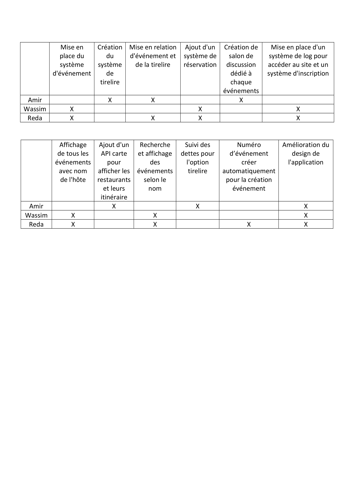
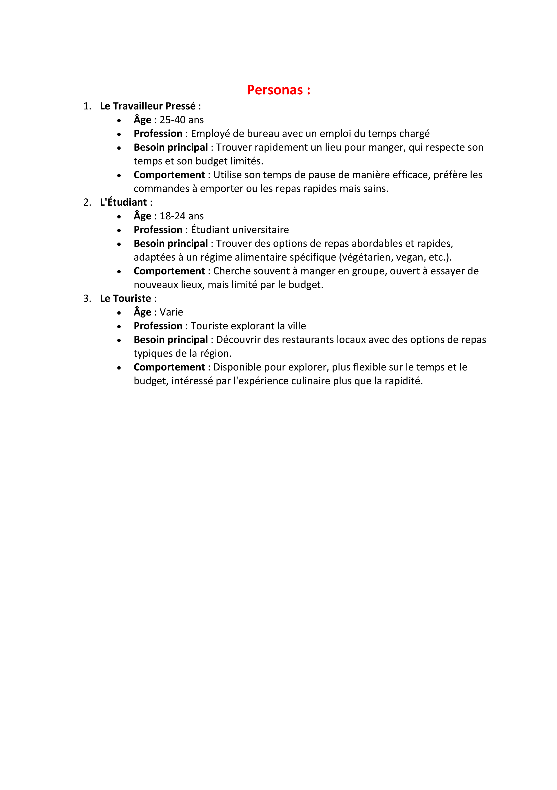
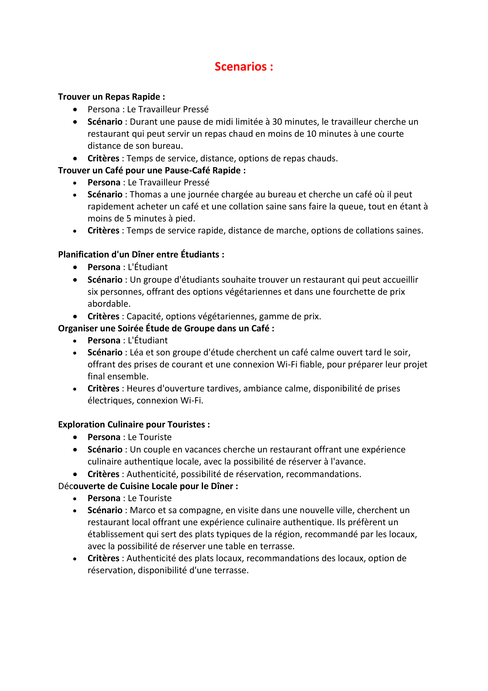
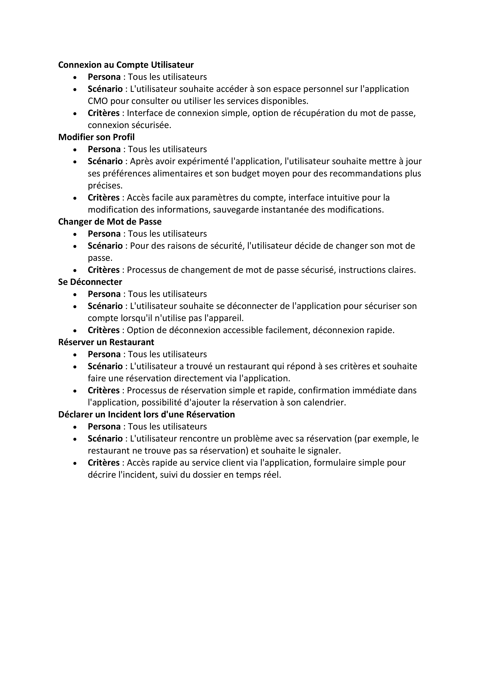

= Ca Mange Oùùù
:doctype: book

# CMO

[release&style=flat-square)](build.gradle)
 

 

## Besoin :

Nous allons manger à la pause mais nous ne savons pas où, notre temps et budget sont limitées …

## Solution :

Nous souhaitons créer un site web qui va nous donner la liste des restaurants, fast food,… disponibles aux alentours selon plusieurs critères de sélection (prix, temps de service, régime alimentaire ...) en utilisant la géolocalisation. Plus tard, nous souhaiterions intégrer une IA qui nous pose 3 questions lors de l'entrée sur l'appli telles que 

 - "Combien de temps as-tu ?", 
 - "Souhaites tu manger chaud ou froid ?" 
     et qui déterminera une liste bien plus restreinte de restaurants selon la demande. Nous nous connecterons à une BDD externe afin de récolter de multiples infos sur les restaurants. 
## Type d’application (mobile, Web, …) :
Application Web

## Fonctionnalités :
(3 ou 4, en prévisionnel, cela pourra évoluer en fonction des itérations) :
-	Gérer les profils des utilisateurs 
-	Se renseigner sur un restaurant
-	Réserver un restaurant
-	Noter les restaurant
-	Créer un espace de chat

## Lancement du projet : 

### Pour le Front-end : 
La partie Front-end du projet est réalisé à l'aide du framework Angular.
Pour pouvoir lancer le Front-end assurez-vous d'avoir :
- Installer le runtime Node, que vous pouvez installer sur "nodejs.org". Fourni avec Node vous avez le package manager "npm" qui vous permettra d'installe le CLI d'Angular. (Si vous êtes sur Mac consulter cette documentation "https://docs.npmjs.com/resolving-eacces-permissions-errors-when-installing-packages-globally" pour résoudre les éventuels erreurs de permission)
- Installer le CLI d'Angular avec la commande "npm i -g @angular/cli" (pour vérifier la version d'Angular taper la commande "ng v")
- Tapez la commande "npm install" avant de lancer le serveur
- Enfin vous pouvez lancer le Front-end en tapant la commande "ng serve", un lien vous sera donner (http://localhost:4200) ouvrer ce lien sur votre navigateur (!! Assurez-vous d'avoir le port 4200 de libre, sans cela vous ne pourez pas accèder au données du back-end).

### Pour le Back-end :
La partie Back-end du projet est réalisé à l'aide de Node.js et de différents frameworks tels que Express.js.
Pour pouvoir lancer le Back-end assurez-vous d'avoir : 
- Installer le runtime Node si ce n'est pas déja fait.
- Installer l'outil nodemon avec la commande "npm install -g nodemon" (Assurez-vous que le port 3000 soit libre)
- Enfin vous pouvez lancer le server back-end avec la commande "nodemon server"

### Infos : 
!!! Lancez le serveur back-end avant de lancer le front-end pour que les données soit charger en avant !!!

== Fichiers
=== Matrice Contribution en Python
[source,txt]
----
Contributeur | Commits | Lignes ajoutées | Lignes supprimées | Back-end | Front-end | Principal
wassim.hendali2@gmail.com | 13 | 71016 | 122 | 2772 | 253 | 67869
146457330+amiirmmr@users.noreply.github.com | 12 | 216 | 11 | 0 | 0 | 205
reda.ramzi0104@hotmail.com | 51 | 601132 | 2904 | 569744 | 28465 | 19
mammeriamir4@gmail.com | 20 | 508263 | 6153 | 67722 | 1568 | 432820
119413560+redarmz@users.noreply.github.com | 8 | 231265 | 45 | 230265 | 469 | 486
113892426+WassimH94@users.noreply.github.com | 5 | 10 | 10 | 0 | 0 | 0
----

=== Matrice Contribution en Ruby
[source,txt]
----
Contributeur | Commits | Lignes ajoutées | Lignes supprimées | Back-end | Front-end | Principal
wassim.hendali2@gmail.com | 13 | 71016 | 122 | 2772 | 253 | 67869
146457330+amiirmmr@users.noreply.github.com | 12 | 216 | 11 | 0 | 0 | 205
reda.ramzi0104@hotmail.com | 50 | 601132 | 2904 | 569744 | 28465 | 19
mammeriamir4@gmail.com | 20 | 508263 | 6153 | 67722 | 1568 | 432820
119413560+redarmz@users.noreply.github.com | 8 | 231265 | 45 | 230265 | 469 | 486
113892426+WassimH94@users.noreply.github.com | 5 | 10 | 10 | 0 | 0 | 0
----
<<<

=== MatriceFeatures
[image,png]

=== Agilite - Page 1
[image,png]

=== Agilite - Page 2
[image,png]

=== Agilite - Page 3
[image,png]

